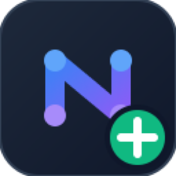
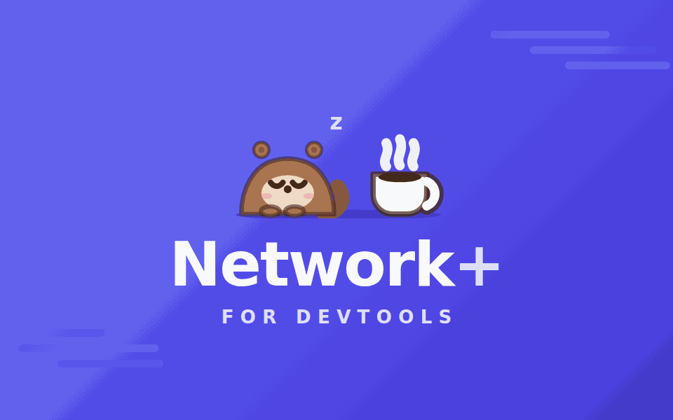
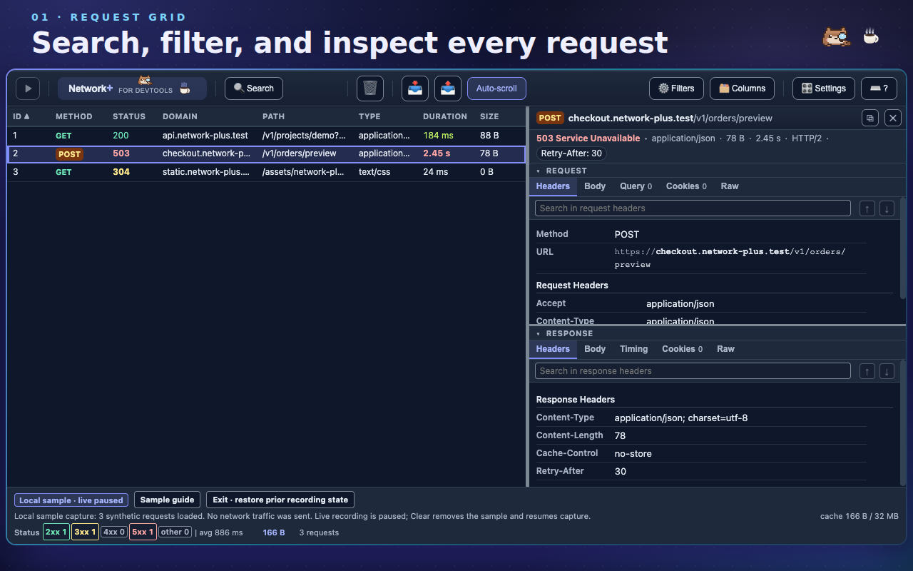
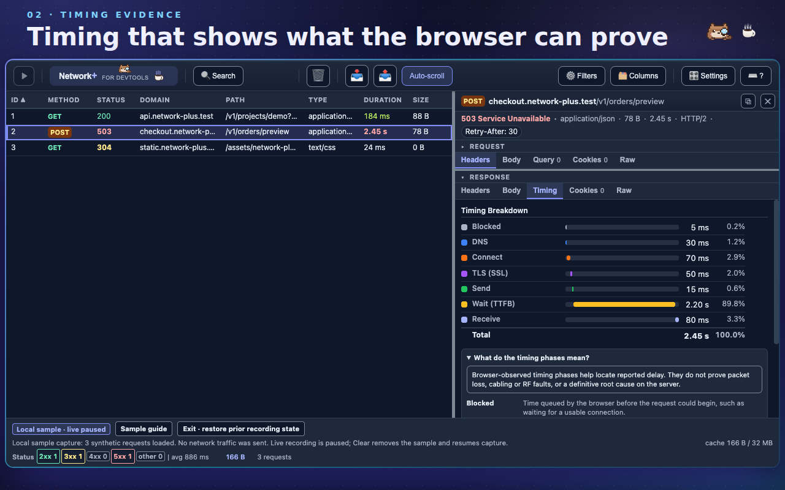
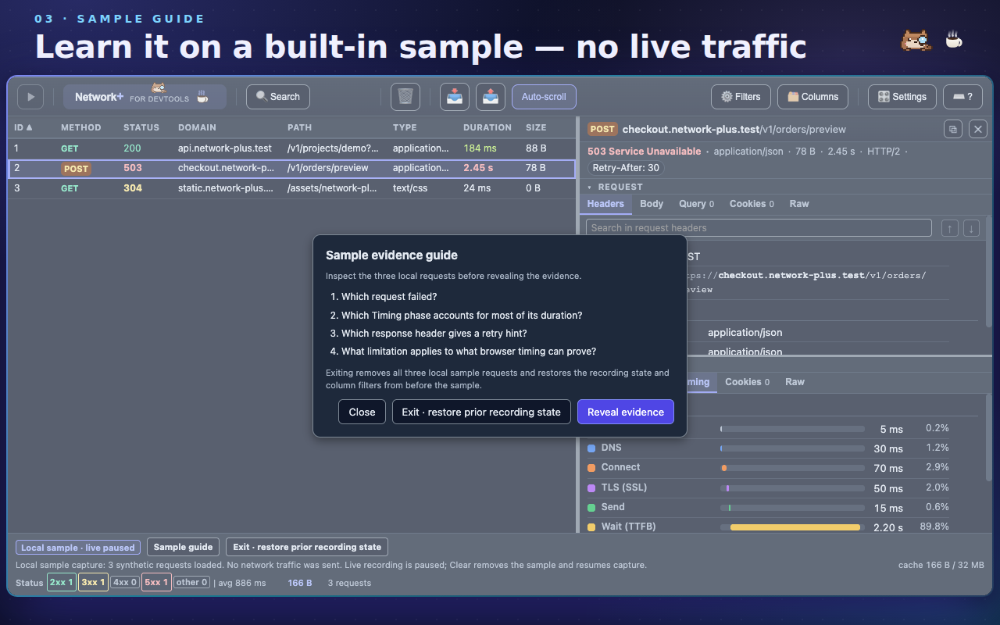
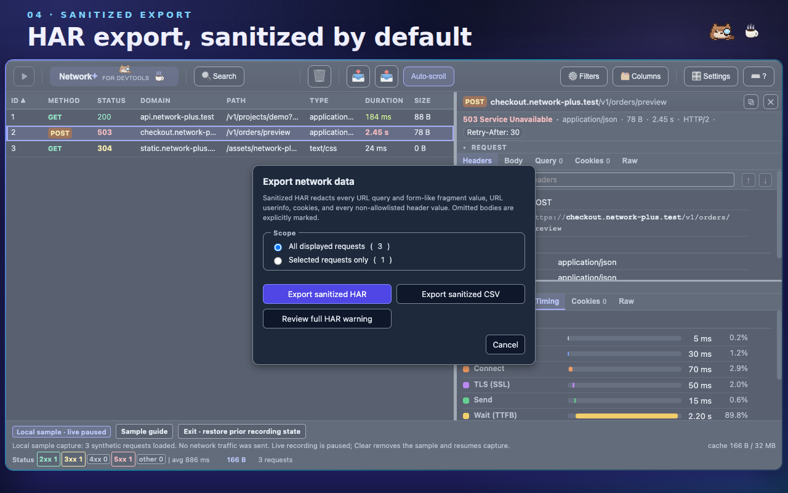

<div align="center">



# Network+ for DevTools

**A power-user network panel for Microsoft Edge and Google Chrome DevTools.**
Multi-keyword search, per-column filters, two-request diffing, and HAR export that is sanitized by default.

[](https://github.com/himiyosh/network-plus-extension/actions/workflows/quality-gates.yml)
[](https://github.com/himiyosh/network-plus-extension/releases/latest)
[](https://chromewebstore.google.com/detail/mhidipnhdnonbjkfklcohmnnmfggjlpo)
[](https://microsoftedge.microsoft.com/addons/detail/network-for-devtools/dhmafmhaagefmichhmmkknapalhmlmal)
[](manifest.json)
[](package.json)
[](LICENSE)
[](https://github.com/sponsors/himiyosh)

**English** · [日本語 (Japanese)](README.ja.md)

[Quick start](#-quick-start) · [Features](#-features) · [Usage](#-usage) · [Data safety](#-data-safety) · [Development](#-development) · [Docs](#-documentation) · [Sponsor](#-sponsor)



<sub>Frames captured from the built-in local sample capture. All traffic shown is synthetic <code>.test</code> data; no real request is sent.</sub>

</div>

**Try it now:** [Download the latest release ZIP](https://github.com/himiyosh/network-plus-extension/releases/latest) · [Chrome Web Store](https://chromewebstore.google.com/detail/mhidipnhdnonbjkfklcohmnnmfggjlpo) · [Edge Add-ons](https://microsoftedge.microsoft.com/addons/detail/network-for-devtools/dhmafmhaagefmichhmmkknapalhmlmal) · [Report an issue](https://github.com/himiyosh/network-plus-extension/issues/new/choose) · [Sponsor](https://github.com/sponsors/himiyosh)

---

## ✨ Why Network+

The stock Network panel is great at showing you traffic. Network+ is built for the moment **after** that — when you have 4,000 requests, a customer waiting, and one failing call to find and explain.

- **Find the evidence.** Search several keywords at once across URLs, headers, and bodies, each with its own highlight color, match count, and next/previous navigation.
- **Narrow without losing context.** Combine per-column filters (time range, method multi-select, `contains` / `notcontains` rules, include/exclude URL logic), isolate or exclude a domain straight from a row's right-click menu, and keep your standard setup one click away as a saved view preset.
- **See traffic by domain.** An optional summary strip above the grid (toggled from the 🗂️ Columns menu) shows each domain's request count, transferred bytes, and 4xx/5xx errors, updating live as requests stream in. Click a domain to show only its requests, click again to clear — the same filter rules the Filters popup edits, so they show, count, and clear there too. Works identically in the pop-out mirror tab.
- **Compare two requests directly.** Select exactly two rows and diff URL, query, method, status, headers, and body side by side.
- **Pop out into a browser tab.** One click opens the same panel as a regular tab that live-mirrors the DevTools session — big-screen triage while DevTools stays docked, with no extra permissions.
- **Share without leaking.** Every copy and every export is sanitized by default — HAR, or a metadata-only CSV for spreadsheet triage. Full output is never the default: the row menu keeps its full formats in a collapsed `Copy full (unsanitized)` group that names what it hands out, and full HAR export and full body copies additionally require a per-action confirmation that is never remembered.
- **Bounded where it counts.** Response bodies always obey a 1 MiB per-body and 32 MiB shared-cache limit, with visible counters and predictable eviction. Request rows are kept in full by default so a long session never silently loses the request you were about to look for; the Settings dialog states the memory cost of that and caps them from 100 to 100,000 whenever you want the bound back.
- **Work by keyboard.** Every control is reachable without a mouse, in System / Dark / Light themes that all meet WCAG 2.2 AA contrast.
- **Settings in one place.** The 🎛️ Settings dialog gathers language, theme, and capture retention. Explanations, tooltips, empty-state text, the timing guide, and every dialog — item names included — are available in Japanese (System / English / 日本語). Toolbar buttons and column headers stay in English, so a written instruction still names what you click and an export keeps its English column names.
- **No build, no telemetry, no network.** Plain files loaded straight into Edge or Chrome; the extension holds a single permission (`storage`) and sends nothing anywhere.

<details>
<summary><b>More screenshots</b></summary>

| | |
|---|---|
|  |  |
| **Request inspector** — tabbed Request and Response views for headers, body, query, cookies, timing, and raw text. | **Timing breakdown** — per-phase numbers, a bar, and an inline guide explaining what each phase does and does not prove. |
|  |  |
| **Local sample capture** — a three-request synthetic capture with a prompt-first guide, so you can learn the panel before pointing it at real traffic. | **Sanitized export** — the safe export is the default action; the full export sits behind a warning you must read every time. |

</details>

## 🚀 Quick start

### Install from the browser store

| Browser | Listing |
|---|---|
| Google Chrome | [Chrome Web Store](https://chromewebstore.google.com/detail/mhidipnhdnonbjkfklcohmnnmfggjlpo) |
| Microsoft Edge | [Edge Add-ons](https://microsoftedge.microsoft.com/addons/detail/network-for-devtools/dhmafmhaagefmichhmmkknapalhmlmal) |

Open the listing for your browser, add the extension, then open DevTools (<kbd>F12</kbd>) — a **Network+** tab is now available. The store build updates itself, so this is the route to take unless you need a specific build.

### Install from the release ZIP

1. Download the ZIP from the [latest release](https://github.com/himiyosh/network-plus-extension/releases/latest) — the release notes there list what changed.
2. Extract it into a new folder. The browser loads the folder that contains `manifest.json`, not the ZIP itself.
3. Open `edge://extensions/` in Microsoft Edge, or `chrome://extensions/` in Google Chrome, and turn on **Developer mode**.
4. Choose **Load unpacked** and select the folder from step 2.
5. Open DevTools (<kbd>F12</kbd>) — a **Network+** tab is now available.

> [!NOTE]
> These steps load an unpacked build in Developer mode, which is what you want to try a build before it reaches the stores or to pin one exact version. A store install updates itself; an unpacked one does not. See the [privacy notice](docs/privacy.md), [Edge Add-ons submission dossier](docs/edge-addons-submission.md), and [Chrome Web Store submission dossier](docs/chrome-web-store-submission.md) for the reviewed data-handling and submission fields.

### Install from source

Requirements: current stable Microsoft Edge or Google Chrome, and Node.js 22 or 24 LTS for the test and lint tooling.

```bash
git clone https://github.com/himiyosh/network-plus-extension.git
cd network-plus-extension
npm ci
```

Then open `edge://extensions/` or `chrome://extensions/`, turn on **Developer mode**, choose **Load unpacked**, and select the cloned repository root. There is no build step — the browser loads the source files as they are.

### Browser support

| Browser | Status | Notes |
|---|---|---|
| Microsoft Edge | Primary | Reference environment for development and release verification; listed on [Edge Add-ons](https://microsoftedge.microsoft.com/addons/detail/network-for-devtools/dhmafmhaagefmichhmmkknapalhmlmal) |
| Google Chrome | Supported | Verified below; listed on the [Chrome Web Store](https://chromewebstore.google.com/detail/mhidipnhdnonbjkfklcohmnnmfggjlpo) |
| Firefox / Safari | Not supported | Different DevTools extension APIs and Manifest V3 implementations |

There is no browser-specific branch in the source. The only extension APIs used are `chrome.devtools.network`, `chrome.devtools.panels`, `chrome.storage.local`, and `chrome.runtime` — all Chromium standard.

Verified for Chrome:

- Chrome 151 loads `manifest.json` with no extension errors.
- All 121 real-browser regression tests pass under Chrome 151 (`CHROME_BIN=<path> npx jest tests/status-summary-browser.test.js tests/browser-availability-policy.test.js`).
- The `Network+` tab appearing in a real Chrome DevTools window was confirmed manually. Only this last step sits outside automated coverage: DevTools extension panels do not load reliably under automation — no probe could enumerate even the built-in panels — so CI cannot assert it.

### First run

With the panel open and no traffic captured yet, choose **Explore sample capture**. It loads three synthetic requests (a 200 API call, a slow 503, and a 304 cache hit), sends no network traffic, and pauses live recording so the sample never mixes with real requests. **Exit · restore prior recording state** puts everything back exactly as it was.

## 🧰 Features

### Capture and retention

- Live capture through `chrome.devtools.network.onRequestFinished`, appended per animation frame so existing rows are never re-rendered.
- Request rows are retained in full by default, with an in-dialog warning that memory can grow without bound. Turning Unlimited off in Settings caps them anywhere from 100 to 100,000 and evicts the oldest first.
- Response bodies are capped independently at 1 MiB per body and 32 MiB across the shared cache, with least-recently-used eviction that keeps the rows themselves.
- Pause / Resume recording, auto-scroll that switches itself off when you scroll up, and `Clear` with a 10-second **Undo clear**.
- Import HAR (`.har`) and Fiddler SAZ (`.saz`) archives; import is atomic and never destroys the current capture if the file is rejected. Chrome HAR files that carry `_webSocketMessages` get those frames threaded into the same request/response Body panes that live WebSocket capture uses — and live-captured WebSocket conversations are written back out the same way: exported full HARs carry `_webSocketMessages` (text frames up to the 2 KB capture preview, binary frames counted without payload, every fidelity loss declared on the entry), while sanitized exports omit the frames with a per-entry marker.
- **Opt-in stream capture (WebSocket + SSE).** The **Stream capture** toggle in the status bar wraps the page's `WebSocket` and `EventSource` constructors through the DevTools eval API — no extra permissions — and records each connection as a row: sent WebSocket frames land in the request Body pane; received frames, Server-Sent Events (named events included, once the page listens for them), and lifecycle marks in the response Body pane, all searchable and export-sanitized like any other body. Only connections created while capture is on are seen, the wrappers never alter traffic, and a navigation reinstalls them automatically.
- **Navigation does not clear the capture.** Rows persist across page navigations, bodies already prefetched into the bounded cache stay readable, and bodies the page navigated away from before retrieval are marked with an explicit notice instead of failing later — the status bar reports both counts.

### Inspect

- 16 columns — Match, ID, Method, Status, Domain, Path, Type, Duration, Size, and Client start, plus Server done, Initiator, URL, Waterfall, Operation, and a configurable Header column hidden by default. Match carries the row-state chips: one per search keyword the row hit, in that keyword’s colour, so a row matching several keywords says which ones instead of wearing only the first one’s tint. The Header column binds to any header name you type in the Columns menu (response headers win, request headers are the fallback) — chase a trace id or cache status across the whole capture, sortable and filterable like every other column. Visibility, width, and order all persist.
- Tabbed inspector: Request (Headers / Body / Query / Cookies / Raw) and Response (Headers / Body / Preview / Cookies / Timing / Raw). The Body and Raw views each carry their own keyword search in a bar pinned to the bottom of the pane, with hit highlighting and Enter / Shift+Enter navigation, and response bodies are decoded with the charset their `Content-Type` declares (Shift_JIS, EUC-JP, and friends render correctly). Bodies that are not text at all — images, fonts, `.wasm` — are shown as an offset/hex/printable dump rather than decoder mojibake, and `Preview` paints an image on a transparency checkerboard, enlarging one too small to see and stating the factor beside its real dimensions.
- Timing breakdown per phase (blocked, DNS, connect, TLS, send, wait, receive) with an inline guide and an explicit statement of what browser-reported timing cannot prove.
- **Compare 2 selected requests** — <kbd>Ctrl</kbd>/<kbd>⌘</kbd>-click exactly two rows to diff URL, query parameters, method, status, protocol, headers, and body, with matching, changed, and one-sided values color-coded.
- **Operation column for API traffic** — off by default in the Columns menu: GraphQL `operationName` (or the parsed query / mutation / subscription name, batches included) and JSON-RPC `method` are pulled from POST bodies, so "POST /graphql" rows read by what they actually do. Sortable and filterable like any column, and echoed in the request Headers pane.
- **JWT decode, inline** — any header value shaped like a JWT (Authorization: Bearer and friends, request or response side) gains an expandable section in the Headers panes with the decoded header and claims, humanized `exp` / `nbf` / `iat` times, and an "expired N min ago" flag. Display only: signatures are not verified, and sanitized copies keep redacting the raw token.
- **Edit and resend** — the row menu re-sends a captured request as-is, or opens a dialog to tweak method, URL, headers, and body first. The inspected page itself issues the composed request, so cookies, CORS, and the page's security policies apply as usual (browser-managed headers stay browser-managed), and the reply lands as a new captured row. Works from the pop-out mirror tab too (the DevTools session executes it). A cURL command copied from docs or a teammate can be pasted into the dialog to prefill every field — unsupported flags are refused by name instead of guessed.
- Initiator links open the originating source file in DevTools.
- **Pop out into a browser tab** — the 🪟 toolbar button opens this panel as a regular tab that mirrors the DevTools session live: new requests stream in, clears and imports follow within a second, and response bodies are fetched from the DevTools side on demand. The tab's own toolbar drives the session remotely: pause/resume, clear with undo, retention, HAR/SAZ import (the file travels to DevTools over the port), stream capture, and edit-and-resend all execute in the DevTools session, with the buttons reflecting its state within a second. The tab keeps its rows if DevTools closes, initiator entries render as plain text there, and only the guided local sample stays DevTools-side.
- Waterfall column visualizes each request's start offset and timing phases inline.

### Find

- Integrated multi-keyword search (<kbd>Ctrl</kbd>/<kbd>⌘</kbd>+<kbd>F</kbd>): one input per keyword, six highlight colors, per-keyword match counts and ▲▼ navigation, a scope switch for URL / Body / Headers, match options (case / whole word / regex), and a **Matches only** toggle that hides non-matching rows (HAR export follows the displayed set). Scope, match options, and the toggle persist between sessions; keyword text does not.
- Per-column filters: a visual local-time range picker for Client start and Server done, method multi-select, repeatable `contains` / `notcontains` rules for domain and path, and any/all/exclude logic for URLs.
- View preset — the Columns menu keeps one saved view (column visibility + filter rules). Apply restores it (or the factory default before anything is saved) and Update overwrites it with the current view. Presets store column/filter configuration only, never captured traffic.
- Status bar statistics: 2xx / 3xx / 4xx / 5xx / other counts plus average, minimum, and maximum response time, recalculated as filters change.

### Share safely

- **Copy as Markdown.** The row menu copies a sanitized, issue-ready Markdown block (method, redacted URL, status, operation, timing); with several rows selected it also offers one compact Markdown table. The unsanitized variant sits in the row menu's `Copy full (unsanitized)` group, alongside the other seven full formats.
- **Sanitized HAR** (`network-plus-sanitized.har`) is the normal export. **Full HAR** is a separate action gated behind a warning you confirm every single time.
- **Export only the selected rows.** When rows are selected (<kbd>Ctrl</kbd>/<kbd>⌘</kbd>-click, <kbd>Shift</kbd>-click), the export dialog offers a "Selected requests only" scope with live counts; the file gains a `-selected` suffix so exports are never confused. "All displayed requests" stays the pre-checked default on every open.
- Copy actions — Summary, URL, request/response body, raw request/response, cURL, fetch, PowerShell — are sanitized by default and keep valid command syntax after redaction.
- `Copy safe support summary` in the Keyboard Shortcuts dialog copies an allowlisted environment snapshot (version, Edge major, coarse OS family, theme, retention, recording state, display preferences) and no captured traffic. Review it before posting it publicly.

### Fit and finish

- System / Dark / Light themes, persisted via `chrome.storage.local`, all meeting WCAG 2.2 AA for small text and 3:1 for control boundaries.
- Full keyboard operation, with a shortcut reference on <kbd>?</kbd>.
- Responsive from 320 px up; at 800 px and below the request list stacks above the detail panel.
- Match badges never rely on color alone, status changes are announced to screen readers, and decorative motion respects `prefers-reduced-motion`.

## 📖 Usage

1. Open DevTools (<kbd>F12</kbd>) and select the **Network+** tab.
2. Reproduce the problem. Rows stream in live; use **Pause** to freeze the working set.
3. Press <kbd>Ctrl</kbd>/<kbd>⌘</kbd>+<kbd>F</kbd> and add keywords. Each keyword gets its own color and its own ▲▼ navigation.
4. Right-click a column header for a filter scoped to that column, or use **Filters** to edit them all at once. Save what worked with **Update** in the **Columns** menu's preset section.
5. Click a row to inspect it; <kbd>Ctrl</kbd>/<kbd>⌘</kbd>-click a second row and choose **Compare 2 selected requests** from the context menu.
6. Export with **Export sanitized HAR**, or copy a single request as cURL / fetch / PowerShell.

### Open Network+ in its own browser tab

The panel can also run as a regular browser tab that mirrors the DevTools session — useful when the docked panel is too small for an investigation.

1. Open DevTools on the page you are inspecting and switch to the **Network+** tab.
2. Click the **🪟 button** on the right side of the toolbar, between the `🎛️ Settings` button and the `⌨️ ?` button (tooltip: "Open Network+ in a browser tab").
3. A new tab opens and mirrors the session immediately: existing rows appear first, new requests stream in live, and response bodies load on demand from the DevTools side.

Capture stays with DevTools, so keep it open while you work — it does not have to stay visible. When DevTools is undocked into its own window (⋮ menu → Dock side → separate window), clicking 🪟 minimizes that window automatically; restore it from the taskbar whenever you want the panel back. A docked DevTools is part of the page's window and cannot be minimized on its own, so it stays put — undock first for the tidiest setup. In that docked case the mirror tab shows a one-time explainer with the same steps and the close-DevTools warning; tick "Don't show this again" to dismiss it for good. Capture continues uninterrupted while minimized (Stream-capture polling may deliver WS/SSE frames in batches; regular HTTP rows are unaffected). If you close DevTools, the tab keeps its rows and shows "The DevTools session disconnected"; reopening DevTools reattaches the surviving tab automatically within a few seconds and resyncs it to the fresh capture session (clicking 🪟 while that tab is mirroring points you at it instead of opening a duplicate). The 🪟 button exists only inside DevTools, and if the browser blocks the new tab, allow pop-ups for DevTools pages and click again.

### Keyboard shortcuts

| Shortcut | Action |
|---|---|
| <kbd>↑</kbd> / <kbd>↓</kbd> | Navigate rows |
| <kbd>Enter</kbd> / <kbd>Space</kbd> | Select row / open details |
| <kbd>Ctrl</kbd>/<kbd>⌘</kbd>+<kbd>F</kbd> | Toggle the search panel |
| <kbd>Ctrl</kbd>+<kbd>L</kbd> (Windows/Linux) · <kbd>⌘</kbd>+<kbd>K</kbd> (macOS) | Clear all requests |
| <kbd>Ctrl</kbd>/<kbd>⌘</kbd>+<kbd>Shift</kbd>+<kbd>M</kbd> | Open the pop-out mirror tab (DevTools sessions only) |
| <kbd>?</kbd> | Show the keyboard shortcut reference |
| <kbd>Esc</kbd> | Close the current panel, popup, or search |
| <kbd>ContextMenu</kbd> / <kbd>Shift</kbd>+<kbd>F10</kbd> | Row context menu |
| <kbd>Enter</kbd> / <kbd>Space</kbd> on a column header | Sort ascending → descending → off |
| <kbd>Alt</kbd>+<kbd>←</kbd> / <kbd>Alt</kbd>+<kbd>→</kbd> | Move the focused column left / right |
| <kbd>←</kbd> / <kbd>→</kbd> on a resizer or divider | Resize by a small step (<kbd>Shift</kbd> for a large step) |

The in-app dialog on <kbd>?</kbd> lists every binding, including the vertical divider keys used at 800 px and below.

### Reading the Timing tab

The Response **Timing** tab includes a native disclosure, `What do the timing phases mean?`, next to the numbers and legend. It opens with <kbd>Enter</kbd> or <kbd>Space</kbd>, so the meaning never depends on color or hover alone.

| Phase | Reported time |
|---|---|
| **Blocked** | Waiting inside the browser before the request could start, such as waiting for a usable connection. |
| **DNS** | Resolving the host name before connecting. |
| **Connect** | Establishing the connection. When TLS is reported separately, it is excluded here so the phases are not counted twice. |
| **TLS (SSL)** | TLS/SSL negotiation. |
| **Send** | Sending the HTTP request. |
| **Wait (TTFB)** | Waiting after the request was sent until the response started — commonly called TTFB. |
| **Receive** | Receiving the response from the first byte onward. |

**Observability limit:** these are times the browser reported for one request. They help locate reported delay. They do not prove packet loss, cabling or RF faults, or a definitive root cause on the server.

Definitions follow the [HAR 1.2 specification (timings)](http://www.softwareishard.com/blog/har-12-spec/), [W3C Resource Timing Level 2](https://www.w3.org/TR/resource-timing-2/), and the [Chrome DevTools Network overview](https://developer.chrome.com/docs/devtools/network/overview/).

## 🔒 Data safety

Network+ treats the clipboard and HAR downloads as its only outbound surfaces, and makes the safe form the default one. Full output is never the default and is always labelled as unsanitized where it is offered; where it is confirmed, that confirmation applies to the single action and is never stored as a preference.

- **URLs** — credentials and every query and form-like fragment value are replaced with `[REDACTED]`, regardless of parameter name. Names, order, paths, and SPA fragment routes are preserved where they can be parsed.
- **Headers** — only a small structural allowlist (`Accept`, `Content-Type`, `Content-Length`, encoding, connection, and cache directives) keeps its value. URL-bearing headers are run through the URL sanitizer; cookies, `X-*`, and anything auth-, token-, key-, or trace-shaped keeps its name and loses its value.
- **Bodies** — JSON is parsed within byte, depth, and node limits and redacted by defensive heuristics for credential- and PII-shaped keys; form bodies have every value replaced. Anything opaque, binary, multipart, base64, or over the limit is marked `[OMITTED BY NETWORK+]` rather than guessed at.
- **Fail closed** — if the sanitizer cannot process something, the operation fails instead of falling back to the raw data. Clipboard and download errors never echo content into the console, status text, or error messages.
- **HAR provenance** — the sanitized archive records the policy, counts, and any body incompleteness under `_networkPlus`.

This reduces accidental disclosure in what you send outward. It is not a redaction layer for what you see inside DevTools: local inspection still shows the captured values. Full details are in the [privacy notice](docs/privacy.md).

## 🔧 How it works

```
Edge / Chrome DevTools
└── devtools.html          registers the panel via chrome.devtools.panels.create()
    └── panel.html         panel UI
        ├── panel.js       all logic (single IIFE, 15 sections)
        └── panel.css      System / Dark / Light themes via CSS custom properties
```

- **DevTools panel extension.** Requests arrive through `chrome.devtools.network.onRequestFinished`.
- **Pop-out mirror tab.** The same `panel.html` opened with `?view=window`; the DevTools panel connects a `chrome.runtime` port to it, streams serialized rows, reconciles differences through a one-second sync heartbeat, and serves response bodies on demand. No additional permissions.
- **Navigation handling.** `chrome.devtools.network.onNavigated` never clears the table; it only marks not-yet-retrieved bodies as unavailable, because the browser stops serving the previous document's bodies once a navigation commits.
- **No ES modules.** DevTools panel pages do not support `<script type="module">`, so all logic lives in one IIFE file. This is a platform constraint, not a style choice.
- **Buildless.** No bundler, no transpiler. `npm run extension:package` copies an explicit allowlist of 10 runtime files into a ZIP without transforming any code.

| Limit | Value |
|---|---|
| Request rows | unlimited by default · capped 100–100,000 when Unlimited is turned off in Settings |
| Response body | 1 MiB per body · 32 MiB across the shared cache |
| Import file | 32 MiB per file |
| SAZ archive | 20,000 entries · 4 MiB per expanded entry · 64 MiB expanded in total |

The status bar continuously shows body cache usage, with the active retention policy and the cumulative row-eviction, body-omission, body-eviction, and preview-omission counts in its tooltip; the retention limit itself is set from the 🎛️ Settings dialog. See [docs/architecture.md](docs/architecture.md) for the rendering pipeline, eviction rules, import validation, and UI stability rules.

## 🧪 Development

```bash
npm ci                    # install dependencies from the lockfile
npm test                  # Jest with coverage
npm run lint              # ESLint over all first-party JavaScript
npm run format            # Prettier write (format:check for CI parity)
npm run version:check     # 5 release version locations + version-free README routes
npm run integrity:check   # package-lock.json provenance
npm run extension:check   # manifest, permissions, references, CSP, distribution allowlist
npm run extension:package # build the verified release ZIP into dist/
npm run store:check       # Edge/Chrome dossiers, privacy notice, and store PNG consistency
npm run contract:check    # coordinator topology and agent tool-restriction contracts
npm run audit:strict      # npm audit --audit-level=high
npm run text:check -- --base <base-sha> --head <head-sha>   # whitespace / encoding of changed lines
```

[`.github/workflows/quality-gates.yml`](.github/workflows/quality-gates.yml) runs a Node.js 22 / 24 matrix over `npm ci`, Jest, ESLint, release version sync, Prettier, lockfile provenance, changed-line text integrity, extension package integrity, Edge/Chrome submission-kit integrity, dependency audit, and coordinator contracts.

### Tests

| Area | Method | Location |
|---|---|---|
| Pure functions | Jest unit tests | [tests/panel.test.js](tests/panel.test.js) |
| Theme / UI contracts | Jest static contract tests | [tests/ui-contract.test.js](tests/ui-contract.test.js) |
| Extension package integrity | Jest + CI | [tests/extension-package.test.js](tests/extension-package.test.js) |
| Repository integrity | Jest + CI | [tests/repository-integrity.test.js](tests/repository-integrity.test.js) |
| Store submission kit | Jest + CI | [tests/store-readiness.test.js](tests/store-readiness.test.js) |
| Support intake forms | Jest + CI | [tests/support-intake.test.js](tests/support-intake.test.js) |
| Changed-line integrity | Jest + CI | [tests/text-integrity.test.js](tests/text-integrity.test.js) |
| CI governance | Jest static regression | [tests/ci-governance.test.js](tests/ci-governance.test.js) |
| Coordinator contracts | Jest static contract tests | [tests/coordinator-contract.test.js](tests/coordinator-contract.test.js) |
| DOM behavior, export contents, theme switching | Manual, in Edge DevTools | [docs/manual-test-checklist.md](docs/manual-test-checklist.md) |

Browser API mocks live in [tests/setup.js](tests/setup.js).

### Project layout

```
network-plus-extension/
├── manifest.json        Manifest V3 manifest with an explicit CSP
├── devtools.html/.js    registers the Network+ panel
├── panel.html/.js/.css  panel UI, logic, and themes
├── icons/               16 / 48 / 128 px extension icons
├── vendor/              third-party libraries (fflate)
├── scripts/             repository, package, version, and store verification scripts
├── tests/               Jest suites and browser API mocks
├── docs/                architecture, design, product, privacy, changelog, store assets
└── .github/             workflows, agents, Copilot instructions, issue forms, funding config
```

## 🤝 Contributing

Issues and pull requests are welcome. Before opening a PR:

1. Branch from `main` — direct pushes to `main` are not allowed.
2. Use Conventional-Commit-style messages in English: `feat:`, `fix:`, `docs:`, `refactor:`, `chore:`, `test:`.
3. Run `npm test`, `npm run lint`, and the checks relevant to your change.
4. Update the README, relevant `docs/`, and tests in the same pull request as the behavior change. Any user-facing runtime, UI, icon, funding, privacy, store-asset, or README change must add a bullet under `docs/CHANGELOG.md` → `Unreleased`; `npm run changelog:check` enforces this across the complete PR diff.
5. Use ordinary pull-request review and optional code or security review when useful. CI does not require a review-comment marker or reviewer-session UUID.

Repository conventions, the panel's section layout, XSS rules, and the review topology are documented in [.github/copilot-instructions.md](.github/copilot-instructions.md).

**Versioning** follows Semantic Versioning. `version` is bumped only at release time — not per commit — and must stay identical across [manifest.json](manifest.json), [package.json](package.json), the top-level and root entries in [package-lock.json](package-lock.json), and the test fallback constant in [panel.js](panel.js). Run `npm run version:check` to verify all five locations. The READMEs stay deliberately version-free — every release link points at `releases/latest` — so cutting a release never edits them, and `version:check` enforces exactly that.

**Releasing** needs no manual step beyond merging. When a version bump reaches `main`, the [Publish Release workflow](.github/workflows/release.yml) rebuilds the package, re-runs the version, package, and store-kit gates, verifies that the archive digest equals the value recorded in the submission dossiers, and publishes the `vX.Y.Z` GitHub release with the ZIP attached and notes generated from that version's changelog section. Pushing the `vX.Y.Z` tag yourself triggers the same workflow. A version that already has a release is skipped rather than republished, so re-runs are safe.

## 🔐 Security

- Every piece of user data rendered into the DOM goes through `textContent` or DOM APIs. `innerHTML` is not used anywhere.
- The Content Security Policy is declared explicitly in [manifest.json](manifest.json): `script-src 'self'; object-src 'self'`.
- The extension requests exactly one permission, `storage`, used to persist the theme and search preferences (scope, match options, and the Matches only state — never search keywords or captured traffic). HAR downloads use a local Blob URL and a temporary `<a download>` element, so the `downloads` permission is not needed.
- The manifest allows only the 8 top-level keys currently in use; host permissions, background workers, and content scripts are rejected by the validator outright.
- `npm run extension:check` verifies exact permission parity and real usage, runtime path symlink and root boundaries, resource locality, the inline-script ban, the CSP, and the distribution allowlist.

## 🚧 Limitations

- **Chromium browsers only.** Edge and Chrome are supported; Firefox and Safari implement DevTools extensions differently and are out of scope. See [Browser support](#browser-support).
- **No ES modules in DevTools panels.** `import` / `export` cannot be used in `panel.js`.
- **Buildless by design.** Packaging performs no transformation or dependency resolution; it archives audited runtime files only.
- **Local only.** No network requests, no external APIs, no telemetry.
- **Timing is a lead, not proof.** Displayed values are browser-reported observations and do not establish packet loss, physical-layer faults, or a definitive server-side root cause.

## 📚 Documentation

| Document | Contents |
|---|---|
| [docs/architecture.md](docs/architecture.md) | Rendering pipeline, retention and body cache, import validation, UI stability rules |
| [docs/CHANGELOG.md](docs/CHANGELOG.md) | Release history |
| [docs/manual-test-checklist.md](docs/manual-test-checklist.md) | Manual verification checklists for keyboard, sample guide, and high-volume capture |
| [docs/privacy.md](docs/privacy.md) | Public notice on local processing, storage, Clear/Undo, and clipboard/HAR output |
| [docs/PRODUCT.md](docs/PRODUCT.md) | Target users, product purpose, design principles, WCAG 2.2 AA baseline (Japanese) |
| [docs/DESIGN.md](docs/DESIGN.md) | UI tokens, components, theme rules (Japanese) |
| [docs/edge-addons-submission.md](docs/edge-addons-submission.md) | en-US Edge Add-ons submission fields, privacy declarations, certification notes |
| [docs/chrome-web-store-submission.md](docs/chrome-web-store-submission.md) | en-US Chrome Web Store listing, privacy declarations, assets, test instructions, and operator checklist |
| [docs/coordinator-topology.md](docs/coordinator-topology.md) | Coordinator session topology, optional PR review, cleanup gates (Japanese) |
| [docs/store-assets/](docs/store-assets/) | 300x300 logo, 440x280 promotional tile, 1280x800 synthetic screenshots, machine-readable inventory |
| [.github/copilot-instructions.md](.github/copilot-instructions.md) | Coding, security, and testing rules for contributors and agents (Japanese) |
| [.github/agents/](.github/agents/) | Primary project agent and the 6-axis UI/UX review agent |

## 💬 Support

Questions and bug reports go to [GitHub Issues](https://github.com/himiyosh/network-plus-extension/issues/new/choose). Issues are public: remove credentials, customer data, and real traffic before posting, and review the output of `Copy safe support summary` before pasting it.

## 💖 Sponsor

Network+ is a solo, MIT-licensed project with no telemetry, ads, accounts, or paid tier. **Every feature is free, and contributing never unlocks, limits, or changes any of them.**

| Where | Link | Notes |
|---|---|---|
| GitHub Sponsors | [github.com/sponsors/himiyosh](https://github.com/sponsors/himiyosh) | One-time or monthly · no platform fee |
| Ko-fi | [ko-fi.com/studio344](https://ko-fi.com/studio344) | One-time · no account needed |

The same links live in the panel, behind the Network+ brand button itself — the toolbar mark with the pixel otter and steaming cup opens the Support dialog. Network+ sends those sites no captured traffic and no usage data, and cannot tell whether you visited or contributed.

Non-financial help counts just as much: [report a bug or suggest an improvement](https://github.com/himiyosh/network-plus-extension/issues/new/choose), star the repository, or pass it on to a colleague.

## 📄 License

[MIT](LICENSE) © himiyosh
