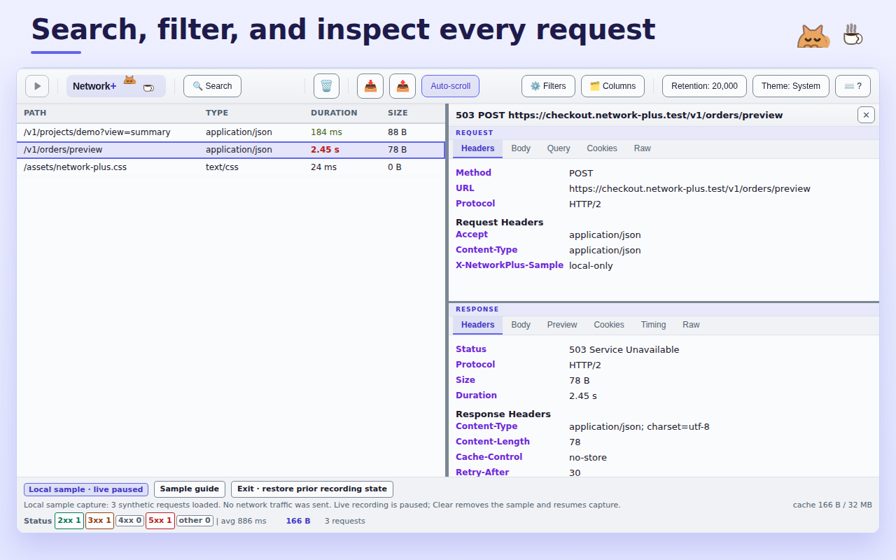
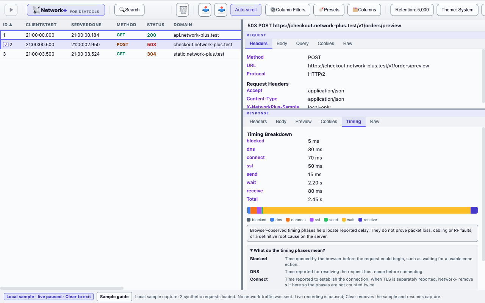
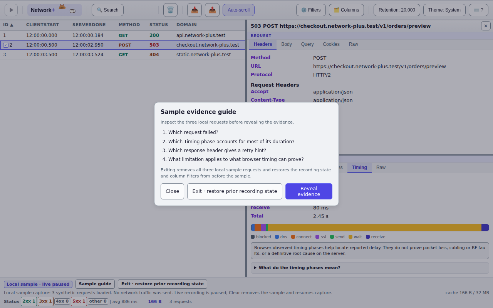
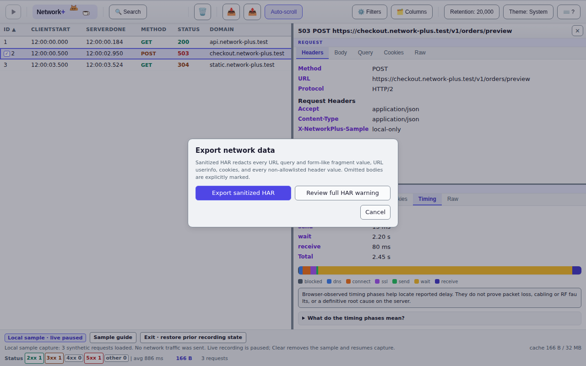

<div align="center">


# Network+ for DevTools

**A power-user network panel for Microsoft Edge and Google Chrome DevTools.**
Multi-keyword search, per-column filters, two-request diffing, and HAR export that is sanitized by default.

[](https://github.com/himiyosh/network-plus-extension/actions/workflows/quality-gates.yml)
[](https://github.com/himiyosh/network-plus-extension/releases/latest)
[](manifest.json)
[](package.json)
[](LICENSE)
[](https://github.com/sponsors/himiyosh)

[Quick start](#quick-start) · [Features](#features) · [Usage](#usage) · [Data safety](#data-safety) · [Development](#development) · [Docs](#documentation) · [Sponsor](#sponsor)


<sub>Frames captured from the built-in local sample capture. All traffic shown is synthetic <code>.test</code> data; no real request is sent.</sub>

</div>

**Try it now:** [Download the v1.7.0 release ZIP](https://github.com/himiyosh/network-plus-extension/releases/download/v1.7.0/network-plus-extension-1.7.0.zip) · [What is in v1.7.0](https://github.com/himiyosh/network-plus-extension/releases/tag/v1.7.0) · [Report an issue](https://github.com/himiyosh/network-plus-extension/issues/new/choose) · [Sponsor](https://github.com/sponsors/himiyosh)

---

## Why Network+

The stock Network panel is great at showing you traffic. Network+ is built for the moment **after** that — when you have 4,000 requests, a customer waiting, and one failing call to find and explain.

- **Find the evidence.** Search several keywords at once across URLs, headers, and bodies, each with its own highlight color, match count, and next/previous navigation.
- **Narrow without losing context.** Combine per-column filters (time range, method multi-select, `contains` / `notcontains` rules, include/exclude URL logic) and save them as named presets.
- **Compare two requests directly.** Select exactly two rows and diff URL, query, method, status, headers, and body side by side.
- **Share without leaking.** Every copy and every HAR export is sanitized by default; full output requires a per-action confirmation that is never remembered.
- **Stay bounded.** Request retention and the response-body cache have explicit limits, visible counters, and predictable eviction — no silent unbounded growth.
- **Work by keyboard.** Every control is reachable without a mouse, in System / Dark / Light themes that all meet WCAG 2.2 AA contrast.
- **No build, no telemetry, no network.** Plain files loaded straight into Edge or Chrome; the extension holds a single permission (`storage`) and sends nothing anywhere.

<details>
<summary><b>More screenshots</b></summary>

| | |
|---|---|
|  |  |
| **Request inspector** — tabbed Request and Response views for headers, body, query, cookies, timing, and raw text. | **Timing breakdown** — per-phase numbers, a bar, and an inline guide explaining what each phase does and does not prove. |
|  |  |
| **Local sample capture** — a three-request synthetic capture with a prompt-first guide, so you can learn the panel before pointing it at real traffic. | **Sanitized export** — the safe export is the default action; the full export sits behind a warning you must read every time. |

</details>

## Quick start

### Install from the release ZIP

1. Download [network-plus-extension-1.7.0.zip](https://github.com/himiyosh/network-plus-extension/releases/download/v1.7.0/network-plus-extension-1.7.0.zip) — see the [v1.7.0 release notes](https://github.com/himiyosh/network-plus-extension/releases/tag/v1.7.0) for what changed.
2. Extract it into a new folder. The browser loads the folder that contains `manifest.json`, not the ZIP itself.
3. Open `edge://extensions/` in Microsoft Edge, or `chrome://extensions/` in Google Chrome, and turn on **Developer mode**.
4. Choose **Load unpacked** and select the folder from step 2.
5. Open DevTools (<kbd>F12</kbd>) — a **Network+** tab is now available.

> [!NOTE]
> Network+ is not yet published on Microsoft Edge Add-ons or the Chrome Web Store. The steps above load an unpacked build in Developer mode. See the [privacy notice](docs/privacy.md), [Edge Add-ons submission dossier](docs/edge-addons-submission.md), and [Chrome Web Store submission dossier](docs/chrome-web-store-submission.md) for the reviewed data-handling and submission fields.

### Install from source

Requirements: current stable Microsoft Edge or Google Chrome, and Node.js 22 or 24 LTS for the test and lint tooling.

```bash
git clone https://github.com/himiyosh/network-plus-extension.git
cd network-plus-extension
npm ci
```

Then open `edge://extensions/` or `chrome://extensions/`, turn on **Developer mode**, choose **Load unpacked**, and select the cloned repository root. There is no build step — the browser loads the source files as they are.

### Browser support

| Browser | Status | Notes |
|---|---|---|
| Microsoft Edge | Primary | Reference environment for development and release verification; an Edge Add-ons submission dossier is prepared |
| Google Chrome | Supported | Verified below; a Chrome Web Store submission dossier and required promotional tile are prepared |
| Firefox / Safari | Not supported | Different DevTools extension APIs and Manifest V3 implementations |

There is no browser-specific branch in the source. The only extension APIs used are `chrome.devtools.network`, `chrome.devtools.panels`, `chrome.storage.local`, and `chrome.runtime` — all Chromium standard.

Verified for Chrome:

- Chrome 151 loads `manifest.json` with no extension errors.
- All 98 real-browser regression tests pass under Chrome 151 (`CHROME_BIN=<path> npx jest tests/status-summary-browser.test.js tests/browser-availability-policy.test.js`).
- The `Network+` tab appearing in a real Chrome DevTools window was confirmed manually. Only this last step sits outside automated coverage: DevTools extension panels do not load reliably under automation — no probe could enumerate even the built-in panels — so CI cannot assert it.

### First run

With the panel open and no traffic captured yet, choose **Explore sample capture**. It loads three synthetic requests (a 200 API call, a slow 503, and a 304 cache hit), sends no network traffic, and pauses live recording so the sample never mixes with real requests. **Exit · restore prior recording state** puts everything back exactly as it was.

## Features

### Capture and retention

- Live capture through `chrome.devtools.network.onRequestFinished`, appended per animation frame so existing rows are never re-rendered.
- Retention defaults to the newest 20,000 requests, configurable from 100 to 100,000. Unlimited request rows are available only after you confirm an explicit warning.
- Response bodies are capped independently at 1 MiB per body and 32 MiB across the shared cache, with least-recently-used eviction that keeps the rows themselves.
- Pause / Resume recording, auto-scroll that switches itself off when you scroll up, and `Clear` with a 10-second **Undo clear**.
- Import HAR (`.har`) and Fiddler SAZ (`.saz`) archives; import is atomic and never destroys the current capture if the file is rejected.

### Inspect

- 13 columns — ID, ClientStart, ServerDone, Method, Status, Domain, Path, Type, Duration, and Size, plus Initiator, URL, and Waterfall hidden by default. Visibility, width, and order all persist.
- Tabbed inspector: Request (Headers / Body / Query / Cookies / Raw) and Response (Headers / Body / Preview / Cookies / Timing / Raw). The Body and Raw views each carry their own keyword search in a bar pinned to the bottom of the pane, with hit highlighting and Enter / Shift+Enter navigation, and response bodies are decoded with the charset their `Content-Type` declares (Shift_JIS, EUC-JP, and friends render correctly).
- Timing breakdown per phase (blocked, DNS, connect, TLS, send, wait, receive) with an inline guide and an explicit statement of what browser-reported timing cannot prove.
- **Compare 2 selected requests** — <kbd>Ctrl</kbd>/<kbd>⌘</kbd>-click exactly two rows to diff URL, query parameters, method, status, protocol, headers, and body, with matching, changed, and one-sided values color-coded.
- Initiator links open the originating source file in DevTools.
- Waterfall column visualizes each request's start offset and timing phases inline.

### Find

- Integrated multi-keyword search (<kbd>Ctrl</kbd>/<kbd>⌘</kbd>+<kbd>F</kbd>): one input per keyword, six highlight colors, per-keyword match counts and ▲▼ navigation, a scope switch for URL / Body / Headers, and a **Matches only** toggle that hides non-matching rows (HAR export follows the displayed set).
- Per-column filters: a visual local-time range picker for ClientStart and ServerDone, method multi-select, repeatable `contains` / `notcontains` rules for domain and path, and any/all/exclude logic for URLs.
- Named filter presets — save, restore, and delete up to 20 filter configurations. Presets store filter values only, never captured traffic.
- Status bar statistics: 2xx / 3xx / 4xx / 5xx / other counts plus average, minimum, and maximum response time, recalculated as filters change.

### Share safely

- **Sanitized HAR** (`network-plus-sanitized.har`) is the normal export. **Full HAR** is a separate action gated behind a warning you confirm every single time.
- Copy actions — Summary, URL, request/response body, raw request/response, cURL, fetch, PowerShell — are sanitized by default and keep valid command syntax after redaction.
- `Copy safe support summary` in the Keyboard Shortcuts dialog copies an allowlisted environment snapshot (version, Edge major, coarse OS family, theme, retention, recording state, display preferences) and no captured traffic. Review it before posting it publicly.

### Fit and finish

- System / Dark / Light themes, persisted via `chrome.storage.local`, all meeting WCAG 2.2 AA for small text and 3:1 for control boundaries.
- Full keyboard operation, with a shortcut reference on <kbd>?</kbd>.
- Responsive from 320 px up; below 700 px the request list stacks above the detail panel.
- Match badges never rely on color alone, status changes are announced to screen readers, and decorative motion respects `prefers-reduced-motion`.

## Usage

1. Open DevTools (<kbd>F12</kbd>) and select the **Network+** tab.
2. Reproduce the problem. Rows stream in live; use **Pause** to freeze the working set.
3. Press <kbd>Ctrl</kbd>/<kbd>⌘</kbd>+<kbd>F</kbd> and add keywords. Each keyword gets its own color and its own ▲▼ navigation.
4. Right-click a column header for a filter scoped to that column, or use **Filters** to edit them all at once. Save what worked with **Presets**.
5. Click a row to inspect it; <kbd>Ctrl</kbd>/<kbd>⌘</kbd>-click a second row and choose **Compare 2 selected requests** from the context menu.
6. Export with **Export sanitized HAR**, or copy a single request as cURL / fetch / PowerShell.

### Keyboard shortcuts

| Shortcut | Action |
|---|---|
| <kbd>↑</kbd> / <kbd>↓</kbd> | Navigate rows |
| <kbd>Enter</kbd> / <kbd>Space</kbd> | Select row / open details |
| <kbd>Ctrl</kbd>/<kbd>⌘</kbd>+<kbd>F</kbd> | Toggle the search panel |
| <kbd>Ctrl</kbd>+<kbd>L</kbd> (Windows/Linux) · <kbd>⌘</kbd>+<kbd>K</kbd> (macOS) | Clear all requests |
| <kbd>?</kbd> | Show the keyboard shortcut reference |
| <kbd>Esc</kbd> | Close the current panel, popup, or search |
| <kbd>ContextMenu</kbd> / <kbd>Shift</kbd>+<kbd>F10</kbd> | Row context menu |
| <kbd>Enter</kbd> / <kbd>Space</kbd> on a column header | Sort ascending → descending → off |
| <kbd>Alt</kbd>+<kbd>←</kbd> / <kbd>Alt</kbd>+<kbd>→</kbd> | Move the focused column left / right |
| <kbd>←</kbd> / <kbd>→</kbd> on a resizer or divider | Resize by a small step (<kbd>Shift</kbd> for a large step) |

The in-app dialog on <kbd>?</kbd> lists every binding, including the vertical divider keys used below 700 px.

### Reading the Timing tab

The Response **Timing** tab includes a native disclosure, `What do the timing phases mean?`, next to the numbers and legend. It opens with <kbd>Enter</kbd> or <kbd>Space</kbd>, so the meaning never depends on color or hover alone.

| Phase | Reported time |
|---|---|
| **Blocked** | Waiting inside the browser before the request could start, such as waiting for a usable connection. |
| **DNS** | Resolving the host name before connecting. |
| **Connect** | Establishing the connection. When TLS is reported separately, it is excluded here so the phases are not counted twice. |
| **TLS (SSL)** | TLS/SSL negotiation. |
| **Send** | Sending the HTTP request. |
| **Wait (TTFB)** | Waiting after the request was sent until the response started — commonly called TTFB. |
| **Receive** | Receiving the response from the first byte onward. |

**Observability limit:** these are times the browser reported for one request. They help locate reported delay. They do not prove packet loss, cabling or RF faults, or a definitive root cause on the server.

Definitions follow the [HAR 1.2 specification (timings)](http://www.softwareishard.com/blog/har-12-spec/), [W3C Resource Timing Level 2](https://www.w3.org/TR/resource-timing-2/), and the [Chrome DevTools Network overview](https://developer.chrome.com/docs/devtools/network/overview/).

## Data safety

Network+ treats the clipboard and HAR downloads as its only outbound surfaces, and makes the safe form the default one. A confirmed full output applies to that single action and is never stored as a preference.

- **URLs** — credentials and every query and form-like fragment value are replaced with `[REDACTED]`, regardless of parameter name. Names, order, paths, and SPA fragment routes are preserved where they can be parsed.
- **Headers** — only a small structural allowlist (`Accept`, `Content-Type`, `Content-Length`, encoding, connection, and cache directives) keeps its value. URL-bearing headers are run through the URL sanitizer; cookies, `X-*`, and anything auth-, token-, key-, or trace-shaped keeps its name and loses its value.
- **Bodies** — JSON is parsed within byte, depth, and node limits and redacted by defensive heuristics for credential- and PII-shaped keys; form bodies have every value replaced. Anything opaque, binary, multipart, base64, or over the limit is marked `[OMITTED BY NETWORK+]` rather than guessed at.
- **Fail closed** — if the sanitizer cannot process something, the operation fails instead of falling back to the raw data. Clipboard and download errors never echo content into the console, status text, or error messages.
- **HAR provenance** — the sanitized archive records the policy, counts, and any body incompleteness under `_networkPlus`.

This reduces accidental disclosure in what you send outward. It is not a redaction layer for what you see inside DevTools: local inspection still shows the captured values. Full details are in the [privacy notice](docs/privacy.md).

## How it works

```
Edge / Chrome DevTools
└── devtools.html          registers the panel via chrome.devtools.panels.create()
    └── panel.html         panel UI
        ├── panel.js       all logic (single IIFE, 15 sections)
        └── panel.css      System / Dark / Light themes via CSS custom properties
```

- **DevTools panel extension.** Requests arrive through `chrome.devtools.network.onRequestFinished`.
- **No ES modules.** DevTools panel pages do not support `<script type="module">`, so all logic lives in one IIFE file. This is a platform constraint, not a style choice.
- **Buildless.** No bundler, no transpiler. `npm run extension:package` copies an explicit allowlist of 10 runtime files into a ZIP without transforming any code.

| Limit | Value |
|---|---|
| Request rows | 20,000 by default · configurable 100–100,000 · unlimited only after explicit confirmation |
| Response body | 1 MiB per body · 32 MiB across the shared cache |
| Import file | 32 MiB per file |
| SAZ archive | 20,000 entries · 4 MiB per expanded entry · 64 MiB expanded in total |

The status bar continuously shows the active retention policy, body cache usage, and cumulative row-eviction, body-omission, body-eviction, and preview-omission counts. See [docs/architecture.md](docs/architecture.md) for the rendering pipeline, eviction rules, import validation, and UI stability rules.

## Development

```bash
npm ci                    # install dependencies from the lockfile
npm test                  # Jest with coverage
npm run lint              # ESLint over all first-party JavaScript
npm run format            # Prettier write (format:check for CI parity)
npm run version:check     # 5 release version locations + README release routes
npm run integrity:check   # package-lock.json provenance
npm run extension:check   # manifest, permissions, references, CSP, distribution allowlist
npm run extension:package # build the verified release ZIP into dist/
npm run store:check       # Edge/Chrome dossiers, privacy notice, and store PNG consistency
npm run contract:check    # coordinator topology and agent tool-restriction contracts
npm run audit:strict      # npm audit --audit-level=high
npm run text:check -- --base <base-sha> --head <head-sha>   # whitespace / encoding of changed lines
```

[`.github/workflows/quality-gates.yml`](.github/workflows/quality-gates.yml) runs a Node.js 22 / 24 matrix over `npm ci`, Jest, ESLint, release version sync, Prettier, lockfile provenance, changed-line text integrity, extension package integrity, Edge/Chrome submission-kit integrity, dependency audit, and coordinator contracts.

### Tests

| Area | Method | Location |
|---|---|---|
| Pure functions | Jest unit tests | [tests/panel.test.js](tests/panel.test.js) |
| Theme / UI contracts | Jest static contract tests | [tests/ui-contract.test.js](tests/ui-contract.test.js) |
| Extension package integrity | Jest + CI | [tests/extension-package.test.js](tests/extension-package.test.js) |
| Repository integrity | Jest + CI | [tests/repository-integrity.test.js](tests/repository-integrity.test.js) |
| Store submission kit | Jest + CI | [tests/store-readiness.test.js](tests/store-readiness.test.js) |
| Support intake forms | Jest + CI | [tests/support-intake.test.js](tests/support-intake.test.js) |
| Changed-line integrity | Jest + CI | [tests/text-integrity.test.js](tests/text-integrity.test.js) |
| CI governance | Jest static regression | [tests/ci-governance.test.js](tests/ci-governance.test.js) |
| Coordinator contracts | Jest static contract tests | [tests/coordinator-contract.test.js](tests/coordinator-contract.test.js) |
| DOM behavior, export contents, theme switching | Manual, in Edge DevTools | [docs/manual-test-checklist.md](docs/manual-test-checklist.md) |

Browser API mocks live in [tests/setup.js](tests/setup.js).

### Project layout

```
network-plus-extension/
├── manifest.json        Manifest V3 manifest with an explicit CSP
├── devtools.html/.js    registers the Network+ panel
├── panel.html/.js/.css  panel UI, logic, and themes
├── icons/               16 / 48 / 128 px extension icons
├── vendor/              third-party libraries (fflate)
├── scripts/             repository, package, version, and store verification scripts
├── tests/               Jest suites and browser API mocks
├── docs/                architecture, design, product, privacy, changelog, store assets
└── .github/             workflows, agents, Copilot instructions, issue forms, funding config
```

## Contributing

Issues and pull requests are welcome. Before opening a PR:

1. Branch from `main` — direct pushes to `main` are not allowed.
2. Use Conventional-Commit-style messages in English: `feat:`, `fix:`, `docs:`, `refactor:`, `chore:`, `test:`.
3. Run `npm test`, `npm run lint`, and the checks relevant to your change.
4. Update the README, relevant `docs/`, and tests in the same pull request as the behavior change. Any user-facing runtime, UI, icon, funding, privacy, store-asset, or README change must add a bullet under `docs/CHANGELOG.md` → `Unreleased`; `npm run changelog:check` enforces this across the complete PR diff.
5. Use ordinary pull-request review and optional code or security review when useful. CI does not require a review-comment marker or reviewer-session UUID.

Repository conventions, the panel's section layout, XSS rules, and the review topology are documented in [.github/copilot-instructions.md](.github/copilot-instructions.md).

**Versioning** follows Semantic Versioning. `version` is bumped only at release time — not per commit — and must stay identical across [manifest.json](manifest.json), [package.json](package.json), the top-level and root entries in [package-lock.json](package-lock.json), and the test fallback constant in [panel.js](panel.js). Run `npm run version:check` to verify all five locations and the README release links. Current version: **1.7.0**.

## Security

- Every piece of user data rendered into the DOM goes through `textContent` or DOM APIs. `innerHTML` is not used anywhere.
- The Content Security Policy is declared explicitly in [manifest.json](manifest.json): `script-src 'self'; object-src 'self'`.
- The extension requests exactly one permission, `storage`, used to persist the theme. HAR downloads use a local Blob URL and a temporary `<a download>` element, so the `downloads` permission is not needed.
- The manifest allows only the 8 top-level keys currently in use; host permissions, background workers, and content scripts are rejected by the validator outright.
- `npm run extension:check` verifies exact permission parity and real usage, runtime path symlink and root boundaries, resource locality, the inline-script ban, the CSP, and the distribution allowlist.

## Limitations

- **Chromium browsers only.** Edge and Chrome are supported; Firefox and Safari implement DevTools extensions differently and are out of scope. See [Browser support](#browser-support).
- **No ES modules in DevTools panels.** `import` / `export` cannot be used in `panel.js`.
- **Buildless by design.** Packaging performs no transformation or dependency resolution; it archives audited runtime files only.
- **Local only.** No network requests, no external APIs, no telemetry.
- **Timing is a lead, not proof.** Displayed values are browser-reported observations and do not establish packet loss, physical-layer faults, or a definitive server-side root cause.

## Documentation

| Document | Contents |
|---|---|
| [docs/architecture.md](docs/architecture.md) | Rendering pipeline, retention and body cache, import validation, UI stability rules |
| [docs/CHANGELOG.md](docs/CHANGELOG.md) | Release history |
| [docs/manual-test-checklist.md](docs/manual-test-checklist.md) | Manual verification checklists for keyboard, sample guide, and high-volume capture |
| [docs/privacy.md](docs/privacy.md) | Public notice on local processing, storage, Clear/Undo, and clipboard/HAR output |
| [docs/PRODUCT.md](docs/PRODUCT.md) | Target users, product purpose, design principles, WCAG 2.2 AA baseline (Japanese) |
| [docs/DESIGN.md](docs/DESIGN.md) | UI tokens, components, theme rules (Japanese) |
| [docs/edge-addons-submission.md](docs/edge-addons-submission.md) | en-US Edge Add-ons submission fields, privacy declarations, certification notes |
| [docs/chrome-web-store-submission.md](docs/chrome-web-store-submission.md) | en-US Chrome Web Store listing, privacy declarations, assets, test instructions, and operator checklist |
| [docs/coordinator-topology.md](docs/coordinator-topology.md) | Coordinator session topology, optional PR review, cleanup gates (Japanese) |
| [docs/store-assets/](docs/store-assets/) | 300x300 logo, 440x280 promotional tile, 1280x800 synthetic screenshots, machine-readable inventory |
| [.github/copilot-instructions.md](.github/copilot-instructions.md) | Coding, security, and testing rules for contributors and agents (Japanese) |
| [.github/agents/](.github/agents/) | Primary project agent and the 6-axis UI/UX review agent |

## Support

Questions and bug reports go to [GitHub Issues](https://github.com/himiyosh/network-plus-extension/issues/new/choose). Issues are public: remove credentials, customer data, and real traffic before posting, and review the output of `Copy safe support summary` before pasting it.

## Sponsor

Network+ is a solo, MIT-licensed project with no telemetry, ads, accounts, or paid tier. **Every feature is free, and contributing never unlocks, limits, or changes any of them.**

| Where | Link | Notes |
|---|---|---|
| GitHub Sponsors | [github.com/sponsors/himiyosh](https://github.com/sponsors/himiyosh) | One-time or monthly · no platform fee |
| Ko-fi | [ko-fi.com/studio344](https://ko-fi.com/studio344) | One-time · no account needed |

The same links live in the panel, behind the ☕ button next to the Network+ brand in the toolbar. Network+ sends those sites no captured traffic and no usage data, and cannot tell whether you visited or contributed.

Non-financial help counts just as much: [report a bug or suggest an improvement](https://github.com/himiyosh/network-plus-extension/issues/new/choose), star the repository, or pass it on to a colleague.

## License

[MIT](LICENSE) © himiyosh
